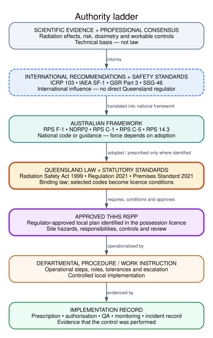
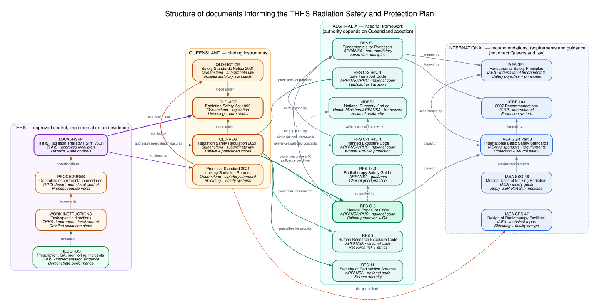
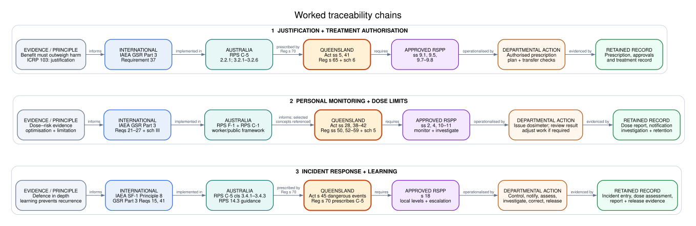

#+title: How the RSPP documents connect
#+author: Ashley Gillman
#+options: toc:nil num:nil
#+STARTUP: hideblocks content

* Reading the maps
The THHS radiation therapy RSPP sits within several layers of documents: Queensland law and licence conditions, Australian codes and guides, and international recommendations and technical evidence. A line between two documents can mean a legal requirement, practical guidance, or a shared technical basis. Read its label before treating it as a requirement.

For example, the Queensland /Radiation Safety Regulation 2021/ makes RPS C-5 a standard licence condition for the relevant medical practices. RPS 14.3 helps practitioners apply RPS C-5 in radiotherapy; the guide itself is not prescribed by that provision. The figures below show these different relationships at different levels of detail.

* Figures
** Authority ladder
This overview follows the path from evidence and international recommendations through national documents and Queensland law to the approved RSPP, local instructions and records. The step from an Australian publication to Queensland law applies only where an adoption or licence mechanism is identified.

#+caption: Authority and implementation layers. .
#+attr_html: :style max-width:100%;height:auto

** Document relationship network
This map names the documents at each layer. Its arrows distinguish legal links such as the Regulation prescribing RPS C-5 from guidance links such as RPS 14.3 supporting C-5. The interactive version lets you select a document to see key takeaways and its full summary.

#+caption: Document relationships. .
#+attr_html: :style max-width:100%;height:auto

** Worked traceability chains
These examples follow a specific control from its source through local implementation and an evidence record. They show how a broad requirement becomes something that can be checked in practice.

#+caption: Worked control traces. .
#+attr_html: :style max-width:100%;height:auto

* Explore the mappings
- [[file:interactive-network/index.html][Interactive document network]] — select a document to read its key takeaways and follow its full summary.
- [[file:concept-explorer/index.html][Interactive concept explorer]] — explore source-attributed relationships between protection concepts across documents.
- [[file:summaries/README.org][Source summaries]] — read the individual document notes and check their authority and scope.
- [[file:wip/rspp-upstream-map.org][Detailed working draft]] — document register, traceability chains and open questions behind these overview figures.
